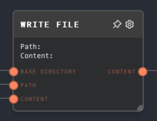
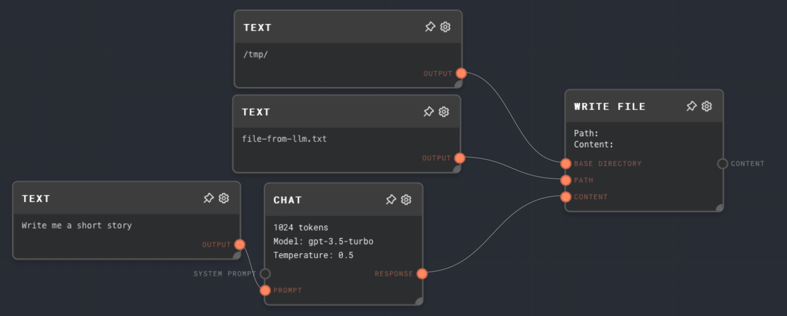
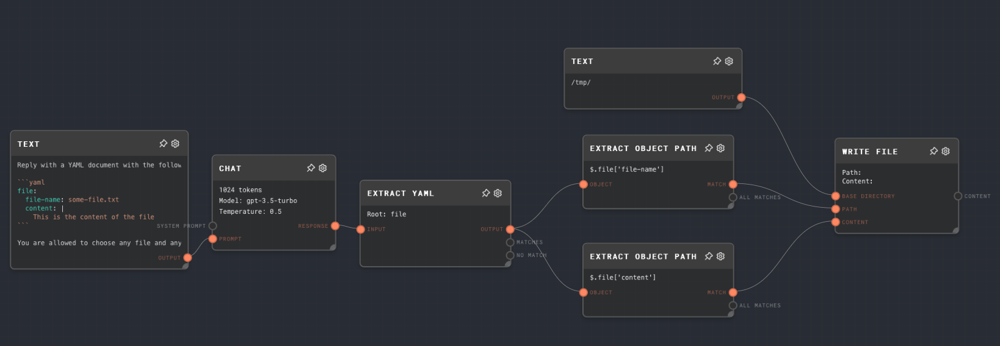
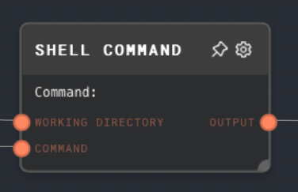
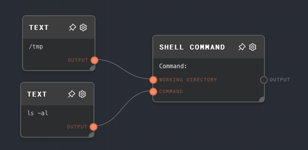

<h1 align="center"></h1>

# ⚠️ Rivet Plugin FS ⚠️

This plugin for [Rivet](https://github.com/ironclad/rivet) adds the following nodes, which only work using the Node executor:

- Write File Node
- Shell Command Node

Note that allowing an AI to write files and execute shell commands is _very dangerous_, and should ideally be only used in a sandboxed environment. These nodes are not included in Rivet by default for this reason.

- [Using the plugin](#using-the-plugin)
  - [In Rivet](#in-rivet)
  - [In the SDK](#in-the-sdk)
- [Nodes](#nodes)
  - [Write File Node](#write-file-node)
    - [Inputs](#inputs)
    - [Outputs](#outputs)
    - [Editor Settings](#editor-settings)
    - [Example 1: Write LLM reply to a hardcoded file](#example-1-write-llm-reply-to-a-hardcoded-file)
    - [Example 2: Allow the LLM to write to a file of its choosing](#example-2-allow-the-llm-to-write-to-a-file-of-its-choosing)
    - [Error Handling](#error-handling)
  - [Shell Command Node](#shell-command-node)
    - [Inputs](#inputs-1)
    - [Outputs](#outputs-1)
    - [Editor Settings](#editor-settings-1)
    - [Example: List files in `/tmp` using `ls -al`](#example-list-files-in-tmp-using-ls--al)
    - [Error Handling](#error-handling-1)
- [Local Development](#local-development)

## Using the plugin

### In Rivet

To use this plugin in Rivet:

1. Open the plugins overlay at the top of the screen.
2. Search for "rivet-plugin-fs"
3. Click the "Install" button to install the plugin into your current project.

### In the SDK

1. Import the plugin and Rivet into your project:

   ```ts
   import * as Rivet from "@ironclad/rivet-node";
   import RivetPluginFs from "@ironclad/rivet-plugin-fs";
   ```

2. Initialize the plugin and register the nodes with the `globalRivetNodeRegistry`:

   ```ts
   Rivet.globalRivetNodeRegistry.registerPlugin(RivetPluginFs(Rivet));
   ```

   (You may also use your own node registry if you wish, instead of the global one.)

3. The nodes will now work when ran with `runGraphInFile` or `createProcessor`.

## Nodes

### Write File Node

The write file node allows Rivet to write to files on the local file system. The node executor is required for this node to work.

The node takes in a base directory (an absolute path), and a file path (a relative path). The node cannot write to paths outside of the base directory, and will throw an error if it is asked to do so.



#### Inputs

See [Editor Settings](#editor-settings) for all inputs.

#### Outputs

| Title   | Data Type | Description                              |
| ------- | --------- | ---------------------------------------- |
| Content | `string`  | The content that was written to the file |

#### Editor Settings

| Setting        | Description                                                                                                  | Default Value     | Use Input Toggle | Input Data Type | Notes                                                                                                                      |
| -------------- | ------------------------------------------------------------------------------------------------------------ | ----------------- | ---------------- | --------------- | -------------------------------------------------------------------------------------------------------------------------- |
| Base Directory | The base directory for all files that will be written. All files written must be inside this base directory. | (from input port) | Yes              | `string`        | Required to be non-empty                                                                                                   |
| Path           | The path and file name of the file to write to. Will be combined with the base directory to write the file.  | (from input port) | Yes              | `string`        | Required to be non-empty. Cannot contain `..`. If the path contains directory segments, those directories will be created. |
| Content        | The content to write to the file.                                                                            | (from input port) | Yes              | `string`        |

#### Example 1: Write LLM reply to a hardcoded file

1. Create two Text nodes, one containins a base directory, such as `/tmp`, and another with a hardcoded file name, such as `file-from-llm.txt`. Connect them to the Write File node's `Base Directory` and `Path` inputs, respectively.
2. Create a Chat node and give it a prompt using a Text node, and connect the response from the Chat node to the Write File node's `Content` input.
3. Run the graph, and the reply from the LLM will be saved to the file specified.



#### Example 2: Allow the LLM to write to a file of its choosing

1. Create a Text node with a prompt for an LLM, something like this:

   ````
   Reply with a YAML document with the following structure:

    ```yaml
    file:
      file-name: some-file.txt
      content: |
        This is the content of the file
   ````

   You are allowed to choose any file and any content you wish.

   ```

   ```

2. Connect that to a Chat node's prompt.
3. Pipe the output of the Chat node into an Extract YAML node, and set the `Root Property Name` to `file` (as that is the root property we've told the LLM to use)
4. Pipe the `Output` port of the Extract Yaml into two Extract Object Path nodes
   1. One with the path `$.file['file-name']`, and connect that to the `Path` input of the Write File node
   2. One with the path `$.file['content']`, and connect that to the `Content` input of the Write File node
5. Connect a text node with a base directory such as `/tmp` to the `Base Directory` port of the Write File Node
6. Run the graph, and observe that the LLM writes to a file in your `/tmp` directory.



#### Error Handling

- If the base directory is empty, the node will throw an error.
- If the path is empty, the node will throw an error.
- If the contents are empty, then an empty file will be written.
- If there is an error writing to the specified file, or the specified file lies outside the base directory, the node will throw an error.

### Shell Command Node

The shell command node can run arbitrary shell commands on the local machine. The node executor is required for this node to work.

The node takes in a working directory, and a command to run. The command is run in the working directory, and the output of the command is returned.

The command is ran using the default shell configured for the machine.



#### Inputs

See [Editor Settings](#editor-settings-1) for all inputs.

#### Outputs

| Title     | Data Type | Description                                        |
| --------- | --------- | -------------------------------------------------- |
| Output    | `string`  | The combined `stdout` and `stderr` of the command. |
| Stdout    | `string`  | The standard output of the command.                |
| Stderr    | `string`  | The standard error of the command.                 |
| Exit Code | `number`  | The exit code that the shell command returned.     |

#### Editor Settings

| Setting                     | Description                                                                       | Default Value     | Use Input Toggle | Input Data Type | Notes                                                 |
| --------------------------- | --------------------------------------------------------------------------------- | ----------------- | ---------------- | --------------- | ----------------------------------------------------- |
| Working Directory           | The working directory that the shell command will be executed in.                 | (from input port) | Yes              | `string`        | Required to be non-empty.                             |
| Shell Command               | The command to execute using the environment default shell.                       | (from input port) | Yes              | `string`        | Just be careful.                                      |
| Error on non-zero exit code | If toggled on, the node will error of the command returns an exit code besides 0. | False             | No               | N/A             | Useful for aborting graphs when something goes wrong. |

#### Example: List files in `/tmp` using `ls -al`

1. Make sure you are using the Node executor.
2. Create two Text nodes, one containing the working directory, such as `/tmp`, and another with the command, such as `ls -al`. Connect them to the Shell Command node's `Working Directory` and `Shell Command` inputs, respectively.
3. Run the graph, and the output of the command will be returned from the Shell Command node.



#### Error Handling

- The working directory and command must both be non-empty. If the are empty, node will throw an error.
- If the shell command does not parse successfully, the node will throw an error.

## Local Development

1. Run `yarn dev` to start the compiler and bundler in watch mode. This will automatically recombine and rebundle your changes into the `dist` folder.

2. The Rivet application installs plugins from NPM into `%APPLOCALDATA/com.ironcladapp.rivet/plugin/[plugin-id]/package` - This is different for each OS. To copy your plugin install directory, open the Add Plugin dialog, and click the Copy button next to the directory shown.

   To develop locally, you have two options:

   - After each change to your compiled bundled, copy your bundled files into the above directory, and restart Rivet.
   - Turn the above plugin directory into your main plugin development directory, and do all your development from that directory. Restart Rivet after each change.
